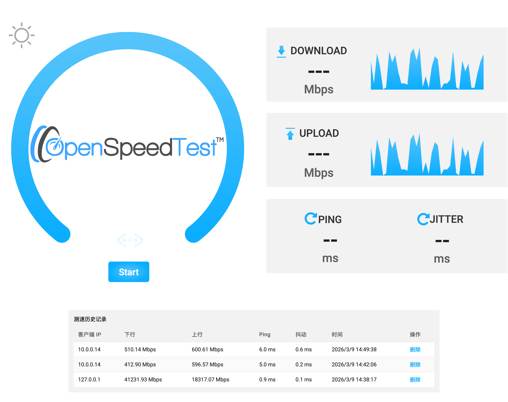

# OpenSpeedTestX

一个适合内网自建的测速项目。前端基于 OpenSpeedTest 的静态测速页面，后端使用 Go 提供静态资源服务、测速历史记录保存。



## Docker Run

本地构建镜像：

```bash
docker build -t YOUR_DOCKERHUB_USERNAME/openspeedtestx:latest .
```

运行容器：

```bash
docker run --rm -p 3000:3000 -v openspeedtestx-data:/app/data q000q000/openspeedtestx:latest
```

启动后访问：

```text
http://YOUR-SERVER-IP:3000
```
